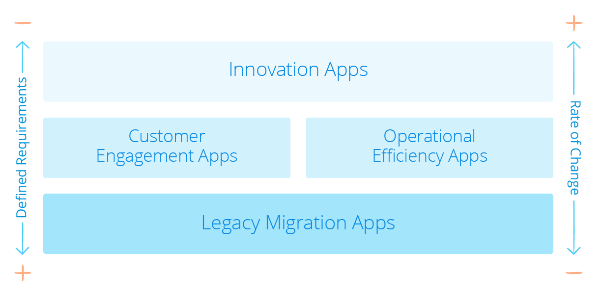

## 1 What Can I Build with Mendix? {#can-i-build}

With Mendix, you can build a wide range of transactional, event-driven, and adjacent applications for all kinds of industries, regardless of complexity, [performance](../enterprise-capabilities/architecture-principles#scalability-performance), or [scale](../enterprise-capabilities/architecture-principles#scalability-performance).

The [Mendix App Gallery](https://gallery.mendix.com) showcases all kinds of applications built using the Mendix Platform. These applications are there to present you with the art of the possible.

### 1.1 What Types of Projects Are a Good Fit for Mendix?

Based on Gartner’s [Pace-Layered Model](https://www.gartner.com/binaries/content/assets/events/keywords/applications/apn30/pace-layered-applications-research-report.pdf), an organization’s application landscape is made up of three distinct layers with a corresponding rate of change. This rate of change is dictated by the uniqueness of the solutions and how concrete the requirements are.

At the bottom of the model, you have the system of record, which is the foundation of the business. This a structurally solid system with a slow rate of change and well-defined requirements. In the middle, you have the system of differentiation, which focuses on fostering outside-in and customer-centric thinking, accelerating the rate of change, and developing unique approaches to sustain differentiation. At the top, you have the system of innovation, which represents brand new ideas for the organization and thus has fuzzy requirements and a high rate of change.

Mendix helps most in projects where the requirements are not completely defined up front and in projects that have a high rate of change. In line with Gartner’s Pace-Layered Application Strategy, a system of differentiation or innovation matches these criteria. For a system of record, Mendix is only a good fit if one of the following points is applicable:

* The application is not available off the shelf
* The off-the-shelf solution is too complex and/or or too expensive
* The customer needs more customization
* The customer needs to differentiate against competitors
* The customer wants more control over future capabilities

There are three types of projects that are a good fit for Mendix:

*  **Systems of innovation projects** that are built to create new ways of working
   *  Often customers do not know exactly what they need, so they need to experiment before and after the app's go-live
*  **Systems of differentiation projects** that extend on core systems projects
   *  In this case, customers have an idea of what they would like to have, and it needs to be different from their competitors
*  **Unique systems of records projects** that modernize legacy systems
   *  Here, customers typically know exactly what they would like to have and the solution is not available off the shelf, since it is a unique system

With fluid requirements and a high rate of change, these types of projects require small cross-functional teams, rapid iteration and releases, and a unified innovation platform like Mendix.

### 1.2 What Are Common Use Cases for Mendix Applications?

Based on the experience of Mendix's hundreds of enterprise customers, there are four common use cases that are perfect fits for developing with a low-code platform like Mendix. These are the four use cases mapped to the Gartner's Pace-Layered Model:

The sections below describe these common use cases in more detail.

#### 1.2.1 Innovation Applications

Innovation applications stem from ideas for new digital business models, products, and channels to help grow and differentiate the organization. Often, they leverage emerging technologies like IoT, AI, and machine learning to unlock new sources of value. Because innovation apps start as ideas (with loose and fuzzy requirements and a high rate of change), they require a high degree of business involvement throughout the entire development process.

This section will highlight some features that enable you to build innovation apps in Mendix along with some examples.

| Challenge                                                    | Need                                                         | How Mendix Helps                                             |
| ------------------------------------------------------------ | ------------------------------------------------------------ | :----------------------------------------------------------- |
| Innovation projects are difficult to get started because of the length, cost, and risk of traditional approaches. | Remove impediments to experimentation,   enabling a test-and-learn approach where new ideas can be vetted quickly and   inexpensively. | <ul><li>The [Mendix licensing model](#evaluate-before) encourages a test-and-learn approach</li><li>The Web Modeler enables business users to build prototypes that development teams can continue to enhance via the Desktop Modeler</li></ul> |
| Traditional development processes make it difficult to translate innovative ideas into successful apps. | Minimize the need for specialized skills, empowering business users to build prototypes and leverage advanced technologies and core systems. | <ul><li>Web Modeler enables business users to build prototypes</li><li>Out-of-the-box [connectors](../app-lifecycle/app-store-reuse#connectors) simplify integrating with third-party databases or applications, handling complex XML messages, and utilize IoT and cognitive services, which enables developers to leverage emerging technologies and legacy systems with minimal dependencies on IT</li></ul> |
| It is difficult to know all requirements up front, which can lead to unsuccessful apps because the wrong functionality is built. | Implement an iterative design and delivery approach with feedback loops to ensure apps deliver their intended   business value. | The easy-to-use Mendix [Developer Portal](../app-lifecycle/agile-requirements-management) with built-in Agile project management features encourages iterative development while actively including the business and incorporating their feedback. |
| Many innovative apps never leave the prototype stage and do not get operationalized at scale. | Ensure new apps can move seamlessly from prototype to large-scale production once success is proven. | <ul><li>Enterprise-grade platform with [cloud-native architecture](../enterprise-capabilities/architecture-principles#cloud-native-architecture)</li><li>Pluggable DevOps build chain for [CI/CD](../app-lifecycle/cicd) with integration of enterprise-specific [ALM testing](../app-lifecycle/test-automation-qa) and [monitoring](../app-lifecycle/monitoring-alerts) tools</li><li>Web-scale architecture, out-of-the box [high availability](../enterprise-capabilities/architecture-principles#high-availability), performance, and [app quality monitoring](../app-lifecycle/devops-overview#modeling-phase)</li></ul> |

Some great examples of innovation apps built with Mendix are AntTail’s [medicine tracking app](https://www.mendix.com/blog/anttail-ensures-quality-medicines-iot/), Solomon Group’s [RFID wristband event access app](https://www.mendix.com/blog/solomon-group-iot-solution/), KLM’s [IoT equipment tracking app](https://www.mendix.com/blog/comes-building-iot-apps-klm-says-just/), and Heijman’s [IoT-based smart building management app](https://www.mendix.com/our-customers/heijmans/).

#### 1.2.2 Customer Engagement Applications

Customer engagement applications enable customers and partners to better interact and/or transact with the business, improving satisfaction, retention, and revenue. With these apps, the business has a fairly well-defined idea of the app, but the development team must adapt to issues revealed during the application lifecycle. Customer-facing applications often encounter high expectations from unforgiving users in terms of both usability and seamless, multi-channel access. There are often underlying operational improvements required to support customer-facing processes, and integration with systems of record is required to support the experience layer and existing processes.

This section will highlight some features that enable you to build customer engagement apps in Mendix along with some examples.

| Challenge                                                    | Need                                                         | How Mendix Helps                                             |
| ------------------------------------------------------------ | ------------------------------------------------------------ | :----------------------------------------------------------- |
| Delivering an engaging user experience with limited budget and UX skills. | Make it easy for individuals without UX backgrounds to build highly usable multi-channel apps with great UIs. | <ul><li>The [WYSIWYG page editor](../app-lifecycle/user-interfaces#build-pages) and [Atlas UI framework](../app-capabilities/ui-design#atlas-ui) enable users without front-end development or UI design skills to create beautiful, engaging, and highly usable multi-channel apps</li><li>The Web Modeler bi-directionally syncs with the Desktop Modeler, allowing the business to   participate in the design process to ensure app usability and success</li><li>Atlas UI enables your company's UI/UX team to create a package containing the organization’s design language for use across development teams, ensuring consistency while broadly leveraging the skills of what could be a small UI/UX team</li></ul> |
| Integrating with systems of record to implement the required process enhancements / automation. | Enable business analysts to automate and optimize business processes by easily incorporating systems of record. | <ul><li>Connectors built using the [Connector Kit](../enterprise-capabilities/extensibility#extend-functionality) and provided through a [Private App Store](../app-lifecycle/user-interfaces#private-templates-styling) allows less technical developers to orchestrate core systems,  thus automating workflows</li><li>Loose coupling prevents integrations from breaking when changes are made in core systems</li></ul> |
| Apps delivered quickly often do not scale or deliver the performance users expect. | Marry rapid development with a   web-scale runtime architecture. | Cloud-native architecture enables elastic scaling for large user bases and automatic failover for continuous operation of critical apps and portals. |

Some examples of customer engagement app built with Mendix are agent/broker portals, customer portals, [self-service policy administration apps](https://www.mendix.com/our-customers/texas-life/), claims management apps, and student service applications for universities.

#### 1.2.3 Operational Efficiency Applications

Operational efficiency applications are employee- or partner-facing applications designed to lower costs by reducing or automating manual or paper-based processes. These apps may support departmental, cross-departmental, or company-wide processes, and they are often driven by compliance needs, particularly in regulated industries. This type of app almost always integrates with core systems. The closer the app is to the core systems of the business, the more critical the operational robustness becomes.

| Challenge                                                    | Need                                                         | How Mendix Helps                                             |
| ------------------------------------------------------------ | ------------------------------------------------------------ | :----------------------------------------------------------- |
| Not realizing the project’s intended complete value because the requirements  are misinterpreted. | Harness the knowledge and feedback of the business from the start through delivery and beyond. | <ul><li>The easy-to-use Developer Portal allows business users to create and track their own user stories</li><li>The Web Modeler allows business analysts to build their own apps as well as automate and optimize business processes</li><li>Visual models provide a shared language between business and IT when more technical developers are involved</li><li>Built-in Agile project management encourages iterative development while including the business and incorporating their feedback</li></ul> |
| Dependencies on core systems and core-IT gate app delivery.  | Make it easy to incorporate systems of record with minimal IT involvement. | <ul><li>Connectors built using the Connector Kit and provided through a Private App Store allow less technical developers to integrate systems of record</li><li>[Visual data mapping](../app-capabilities/data-mappings) allows business analysts and developers to map data of records to the optimal data model for the app</li></ul> |
| The high cost of managing an ever-increasing (and ever-evolving) app portfolio | Apply appropriate governance   without compromising time to value | <ul><li>The Mendix Platform provides logging and controls (preventative, detective, and corrective) out of the box to ensure compliance and quality across the entire portfolio</li><li>The [Mendix Cloud Portal](../app-capabilities/mendix-cloud#cloud-portal) provides DevOps capabilities to both business analysts and developers, while spanning multi-cloud deployments</li></ul> |

Some examples of operational efficiency applications include [claims processing](https://www.mendix.com/blog/ced-repair-agile-customer-centric-business-model-future-proof-platform/), supply-chain management, invoice processing, device tracking, [university registration](https://www.mendix.com/our-customers/north-carolina-state-university/), and [order management](https://www.mendix.com/our-customers/kao/) apps.

#### 1.2.4 Legacy Migration Applications

Most legacy migration Mendix application projects are business-driven transformation initiatives. That is, rather than a pure lift-and-shift of existing functionality, these new apps are meant to replace legacy apps that cannot support new processes or provide the right user experience. As such, they require new functionality, but they should also support current processes.

| Challenge                                                    | Need                                                         | How Mendix Helps                                             |
| ------------------------------------------------------------ | ------------------------------------------------------------ | :----------------------------------------------------------- |
| Need to build a system that remains flexible to adapt to changes. | Employ a modern app architecture that promotes agility by leveraging microservices. | Easily create a microservices architecture with an autonomous app and services that can be recombined and shared. |
| Mission-critical apps fail to deliver the required performance at scale. | Ensure the new solution can be deployed with the required resiliency and high availability for mission-critical use. | Cloud-native architecture enables automatic failover for continuous operation of business-critical apps (out of the box with the Mendix Cloud). |
| Inadequate oversight of quality due to the size and complexity of the solution. | Embed the automated quality measurement and testing within the development lifecycle. | The Mendix [Application Quality Monitor](../app-lifecycle/model-consistency#aqm) provides benchmarks into the maintainability of apps based on the ISO 25010 standard. |
| Usability is often an afterthought, blunting ROI.            | Take a user-first approach when designing the new solution.  | <ul><li>The Mendix Web Modeler allows the business to participate in the design process to ensure app usability and success</li><li>The visual data mapping allows you to create the optimal data model for the new solution (with traceability back to systems of record), not simply recreate the legacy systems’ model</li></ul> |

Examples of legacy migrations include transferring legacy [Lotus Notes](https://www.mendix.com/blog/how-one-customer-is-using-mendix-for-legacy-application-migration/), Microsoft Access, SharePoint, or Excel applications to an updated system.

## 2 What Shouldn't I Build in Mendix? {#should-not-build}

While there are endless possibilities for what apps can be built with the platform, we at Mendix do have some advice on what you should not build in Mendix.

If your application can already be bought off the shelf and provides 100% of the requirements you need, then Mendix suggests buying that off-the-shelf product. Buying such a solution is often more cost-effective (based on best practices) and it is faster to implement. Typically, these off-the-shelf solutions are available for traditional system-of-record applications (which have a low rate of change), because the processes are well-established, common to most organizations, and often subject to regulatory requirements.

However, there are situations when the Mendix platform is a good fit even if the app that needs to be built is a traditional system of record. These are situations in which the off-the-shelf solution is too complex and/or too expensive, you need more customization, you need to differentiate against your competitors, or you would like to have more control over future capabilities. Mendix can extend any application or stay stand-alone.

In addition to such systems of records, the Mendix Platform is not a good fit for building games or replacing full ESB solutions.

The Mendix Platform allows you to build web, mobile, and tablet applications; therefore, it’s not suitable if you are looking to build apps that are not browser- or mobile-based.

## 3 How Can I Quickstart My App Development Project? {#starter-apps}

The Mendix Platform provides several starter apps as part of the onboarding process for [creating new applications](#can-i-build).

Starter apps are complete app frameworks that can be used as a starting point when building a new app on the Mendix Platform. Starter apps provide the scaffolding required to massively accelerate app development, as they include basic design patterns such as branding, design assets, page templates, navigation, and security models.

<video controls  src="attachments/OE_StarterApps.mp4">VIDEO</video>

You can also upload your own starter apps to your [Private App Store](https://docs.mendix.com/community/app-store/share-app-store-content#private-app-store) to make them available as starting points for your whole organization. This way, they can be used to create the root model of all new apps. In addition to basic design patterns, they will often include complete functional building blocks, such as user onboarding workflows, integration frameworks, document management, business rules, and processes.

## 4 What App Development Process Should I Follow with Mendix?

Mendix adopts a DevOps methodology with a high focus on business and IT collaboration, also known as a BizDevOps or DevOps 2.0. Mendix has optimized the BizDevOps approach for the low-code uses. This combination of changing the process to [BizDevOps ](#bizdevops) and using [low-code](#low-code) in this process results in a shorter feedback loop and [changes the roles](#changing-roles) within the software development process.

The sections below go deeper into this Mendix process.

### 4.1 The BizDevOps Process {#bizdevops}

This section explains the concept of the BizDevOps process and compares this with other software development processes.

#### 4.1.1 BizDevOps

BizDevOps encourages developers, operations staff, and business teams to work together so the organization can develop software more quickly, be more responsive to user demand, and ultimately maximize revenue. In this approach, not only does the business team set the requirements, they also work directly with the development team to set priorities for Agile software development sprints and backlogs. The development team becomes partners with the business side and works with business managers to solve problems and achieve business goals.

#### 4.1.2 DevOps

Compared to DevOps, the BizDevOps approach knocks down the silos between the DevOps teams (meaning, the development teams and operations staff) and the business management teams.

#### 4.1.3 Agile

Before the DevOps approach, the Agile methodology changed traditional Waterfall projects from a linear approach (in which feedback could only be given on full working applications) to an iterative, team-based approach to software development. This approach emphasizes the rapid delivery of an application in complete functional components per “time-boxed” phases called sprints. Each sprint has a defined duration with a running list of deliverables, planned at the start of the sprint. The Agile approach enables the business to review a minimal viable product (MVP), which is a product with just enough features to satisfy and enable the business to provide feedback for future development.

#### 4.1.4 Traditional App Development

In traditional app development projects, development teams, operation teams, and business management teams all operated in silos. The development team worked on the app (or better said, worked on the code before the introduction of low-code platforms), the operations team maintained the app after it was released, and the business management team reviewed the app, gave feedback, and set the requirements for new app development projects.

### 4.2 The Low-Code Addition to BizDevOps {#low-code}

Mendix has optimized the BizDevOps approach for the use of low-code, resulting in a feedback loop of less then a month on the app under development. This section will explain how this is done.

On a high level, the 1-month-feedback loop is ensured due to four factors of the Mendix Platform:

* **An integrated feedback mechanism** – The business can provide their feedback on the live app (minimal viable product) through a user friendly feedback mechanism, which is integrated with the Mendix Platform.
* **Team synergy **– The business analyst in the development team speaks the language of the business, can translate the requirements and feedback into user stories, and builds the functionality with the professional developer.
* **1 visual model** – With the Mendix low-code platform, the business analysts is enabled to visually build apps and work together with the professional developer's work on a common model, in a shared environment with ongoing real-time feedback. Any issues are quickly detected and resolved ensuring apps meet business and customer expectations with the first release.
* **1-click deployment** – The one-click deployment to the cloud ensures that the MVP can be released in minutes to enable the business to provide their feedback on the next iteration.

#### 4.2.1 The Evolution of the Feedback Loop

This section will explain how the combination of the evolving processes and the involvement of low-code decreased the feedback loop process from an average of 12 months in traditional Waterfall projects to less than 1 month in low-code BizDevOps projects.

* **12 months, Waterfall** – Due to the bigger teams, the linear approach, and the fact that feedback could only be given on full working applications, the feedback loop in Waterfall projects reached up to 12 months.
* **6 months, Agile** – The iterative process—with providing feedback on an MVP instead of on a full working application—resulted in a 6-month feedback loop for Agile software development projects.
* **3 months, low-code DevOps** –  Instead of working on a big team with specialties in silos, the smaller size of development teams and the use of one-click deployment enables the business to give feedback on the MVP of features instead of the MVP of full applications (as is done in Agile). This results in a 3-month feedback loop.

* **1 month, low-code BizDevOps** – The involvement in the development team of the business analyst who understands the business and the integrated feedback mechanism (which pulls the business directly into the development process) enables the business to directly share their ideas with a development team who understand the requirements without having to first build the feature. This results in a 1-month feedback loop in low-code BizDevOps projects, saving 2 months compared to low-code DevOps projects.

### 4.3 Changing Roles in Low-Code and BizDevOps {#changing-roles}

There are just three roles involved in a core development team in Mendix low-code BizDevOps projects. The other roles that were traditionally part of the development process moved to enablers of the project, and they are often more involved over the complete program/portfolio of apps that are under development.

#### 4.3.1 Three Roles in the Core Development Team

First of all, the business user (who Mendix calls the product owner) has a key role in the BizDevOps process, responsible for providing the input from the business in requirements or feedback on the app, and translating them into user stories.

Next, the business analyst (who talks to the business) works together with a more technical developer to run the entire application delivery lifecycle, including the operations. The involvement of the business analyst is key in interpreting the requirements and feedback from the business correctly. In other words, they speak the same language to verify the UX/UI (pages) and business rules (logic). The technical developer is key to helping build the app and deliver tangible results.

This small development team runs the entire application delivery lifecycle without the direct help of a database expert, Java programmer, UX/UI expert, test engineer, project manager, or operations staff. All these roles are still important, especially in an enterprise-scale delivery of multiple applications. However, they are part of a higher level Center of Excellence, which is often spread between multiple Mendix application development teams.

#### 4.3.2 Roles in Center of Excellence (CoE)

The roles in the Center of Excellence can be seen as enablers of the core development team, delivering the specific knowledge needed to align the development of multiple apps from a performance, UX/UI, integration, architecture, or process perspective.

{}[**Note from Leon to Roald, please validate section 4 - this was a pretty complex part and the messaging on the slides is making it even more complex ;)**]{}

## 5 Where Do I Start with the Mendix Platform? {#where-do-i-start}

Mendix's rapidly growing community consists of a wide range of people, from citizen developers and business analysts who can build Mendix apps without any coding experience, to hardcore developers who build all kinds of apps and extend the Mendix Platform with custom code.

In order to onboard this variety of users, Mendix provides a [guided product introduction tour](#tailored-guidance) based on the user profile and preferences. Next to that, Mendix users can use two Mendix Platform IDEs (the [Web Modeler](../app-lifecycle/app-development#web-modeler) and [Desktop Modeler](../app-lifecycle/app-development#desktop-modeler)) as well as [external IDE's](../enterprise-capabilities/extensibility#external-ides) that integrate with Mendix. The Web Modeler can be used as a no-code development IDE for citizen developers. In the Desktop Modeler, you can build complex integrations and extend your app with custom code and more advanced features. This low-code development IDE enables everyone from business users to experienced professional developers to build advanced apps.

The [free online training materials](https://gettingstarted.mendixcloud.com/link/home) that Mendix provides is built in a modular fashion. This means that you can skip modules depending on your knowledge, or only complete the knowledge checks to see if you need more information about a specific topic.

In addition to Mendix being free to try and evaluate, the Mendix Community Edition gives all users unlimited access to the platform and community environments. see the section [Can I Evaluate Mendix Before I Buy?](#evaluate-before) for more details, and then check out section [5.3 How Do I Create an App?](../app-capabilities/web-apps) when you are ready to create your first app with Mendix.

#### 5.0.1 How Does Mendix Onboard New Users? {#tailored-guidance}

Visual development is fast and easy to understand for all type of users, which means that Mendix onboards users with different knowledge levels and goals on the platform. During the signup, users have the option to share their preferences and goals for using the platform. Based on that information, Mendix tailors the guided product introduction tour to their preferences while providing other help methods, links to our online [Mendix Academy](https://gettingstarted.mendixcloud.com/link/path) material, supplementary content, and suggestions for your next steps. This guidance helps users to understand and navigate the extensive and powerful Mendix Platform.

<video controls  src="attachments/guidance.mp4">VIDEO</video>

### 5.2 Can I Evaluate Mendix Before I Buy? {#evaluate-before}

No problem! Anyone can [sign up](https://signup.mendix.com/link/signup/?source=techevaluationguide) on the Mendix Platform. This will create a Mendix account for you, and you will have access to the Mendix Community Edition. The Community Edition is free, meaning no credit card is required, and there are no setup fees.

#### 5.2.1 What Does the Community Edition Offer?

The Mendix Community Edition includes everything you need to design, build, and deploy demos, prototypes, or small applications. All the features in the Mendix IDEs are available without restriction. This edition includes a deployment environment for each application to the Mendix Cloud for up to 10 internal users with no charge.

The Community Edition is designed to provide developers and business users with a rapid cloud deployment option for prototyping and testing new applications, without having to provision a full cloud node.

##### 5.2.1.1 When Should I Upgrade from the Free Edition to a Paid Edition?

The Community Edition is designed for prototyping and testing new applications, and it is not meant as a professional testing or production environment. The cloud environment of the Community Edition is called a Sandbox environment, where you can test the full capabilities of the platform. Due the restrictions on limited users, the lower CPU, and the fact that the app goes into sleep mode after a longer period with no activity, the Community Edition cannot be used for professional app development projects.

When you start a professional app development project, you need more enterprise-level features and services (for example, more deployment options or formal service-level agreements). In that case you need to upgrade your app to a paid cloud environment. Upgrading is easy, as you will keep your user account and all the apps that you have already built.

##### 5.2.1.2 What’s the Definition of an Application? How Big Can It Be?

The short answer is, you decide, there are no limitations. You need to focus on the business need without having to work around artificial limitations to make your app fit into a licensing model or risk big upcharges. At Mendix, you do not have any of these limitations. Technically, an “app” is the complete application as it is set up and organized in the Mendix Platform. It can contain any combination of screens, database entities, processes, and functional components. You will determine the size of an application based on your use case and desired user experience, as well as the app design, model complexity, and maintenance considerations.

It is important to note that the architecture of your app is very important. Speed and flexibility typically drop when an application becomes too big or complex. The Mendix [Application Quality Monitor](../app-lifecycle/model-consistency#aqm) provides insight on  the right granularity of apps and microservices.

##### 5.2.1.3 How Many Applications Can I Build and Deploy?

There is no limitation to the number or the complexity of applications you can build and deploy using the platform when you select the Mendix Community, Pro, or Enterprise Platform Editions.

### 5.3 What Are the Mendix Training Options? {#options}

The Mendix Academy is integrated into the platform and provides both classroom and online training options.

For all the details on learning Mendix and getting certified, see the section [What Are the Mendix Training Options?](skills-training#training-options) in *Skills & Training*.
