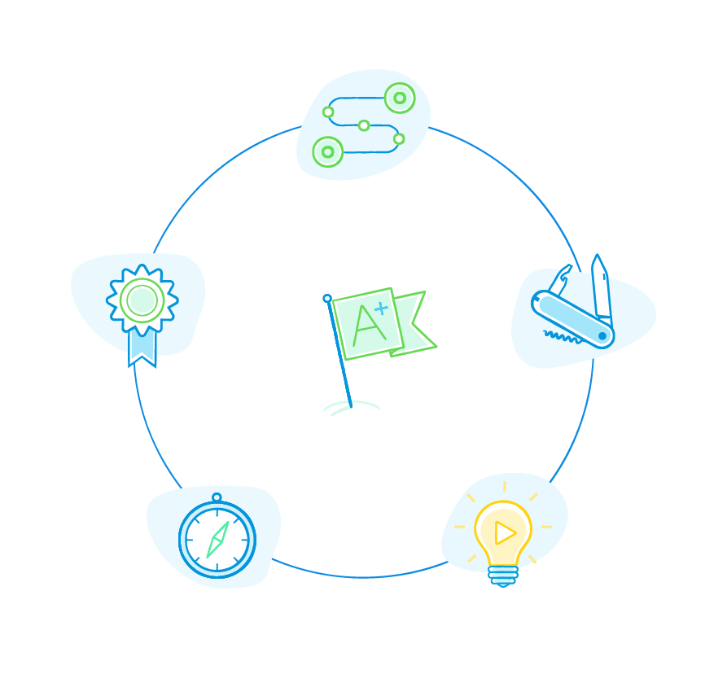

Anyone with an idea can build Apps in Mendix, to help you get started we’ve provided access to a fully integrated suite of training materials and learning paths via our Academy. Learning paths are tailored towards your skill set, from citized developers with little or no development expereince to UI developers/designers, operations and of course, professional software engineers.  In addition our rich and vibrant community with tens of thousands of active members jointly participating and sharing their best practice and experience is always a great resource for accelerated learning.

{}

{}

{}[**Add video when available**]{}

## What Skills Do I Need to Have to Learn Mendix?

All you need is a great idea, and the time to get started, we can help you do the rest. Some basic understanding of database and process modeling and coding will help, but it's not necessary to get started.

For details, see [What Skills Do I Need to Have to Learn Mendix?](skills-training#skills-needed)

## What Are the Mendix Training Options?

The [Mendix Academy](https://gettingstarted.mendixcloud.com/) is fully integrated into the platform with in-product [guided introduction tours](https://mendix-platform-guide.cfapps.io/evaluation-guide/evaluation-learning/skills-training#git), and provides multiple learning paths to onboard all the kinds of Mendix Platform users: -

* Guided Introduction Tour
* Academy
* Learning Paths and Modules
* Classroom courses
* Webinars
* Documentation

For details, see [What Are the Mendix Training Options?](skills-training#training-options)

## How Long Does It Take to Learn Mendix

The answer to this questions depends on your profile and background. For example, you could have your first Starter App up and running in less than 30 minutes, or you could follow the [Become a Rapid Developer](https://gettingstarted.mendixcloud.com/link/path/10) learning path online free. There are 12 modules which take about thirty minutes each to complete, which means you could be done in less than a day and start building applications straightaway.

For details, see [How Long Does It Take to Learn Mendix?](skills-training#how-long-to-learn)

## Read More

* [Skills & Training](skills-training)
* [Certification & Talent](certification-talent)
