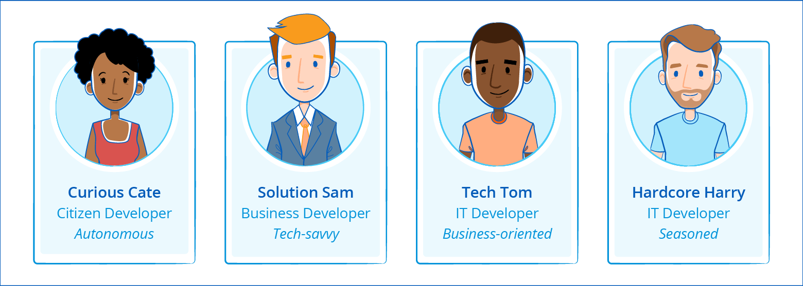
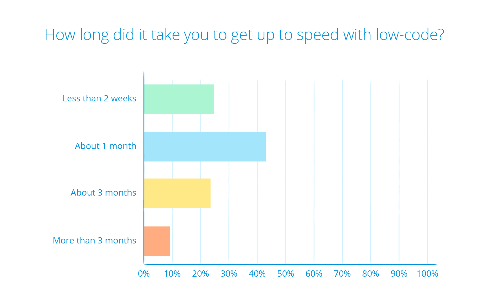
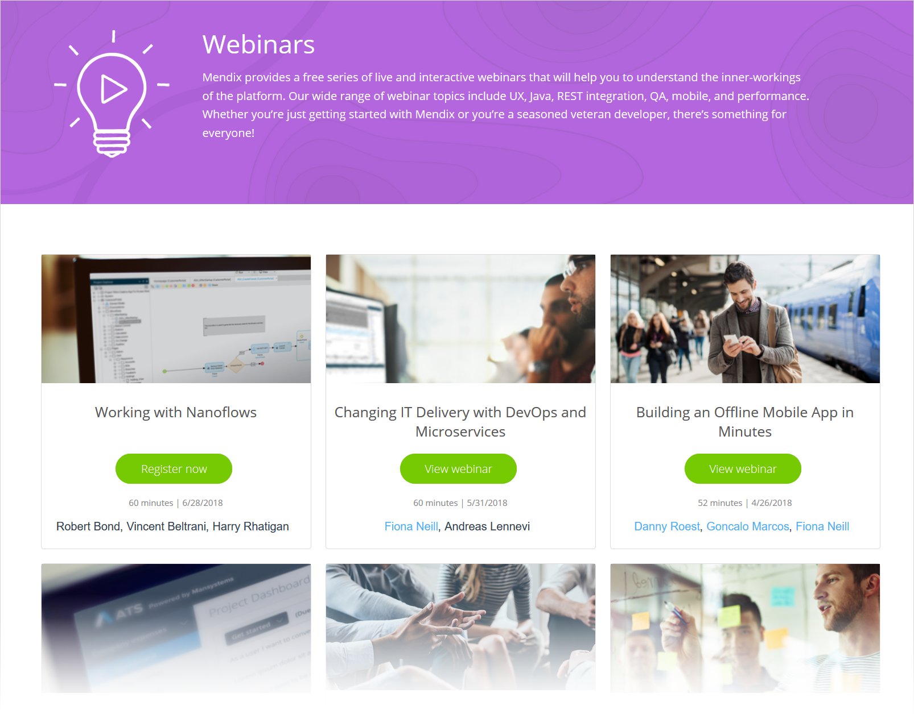
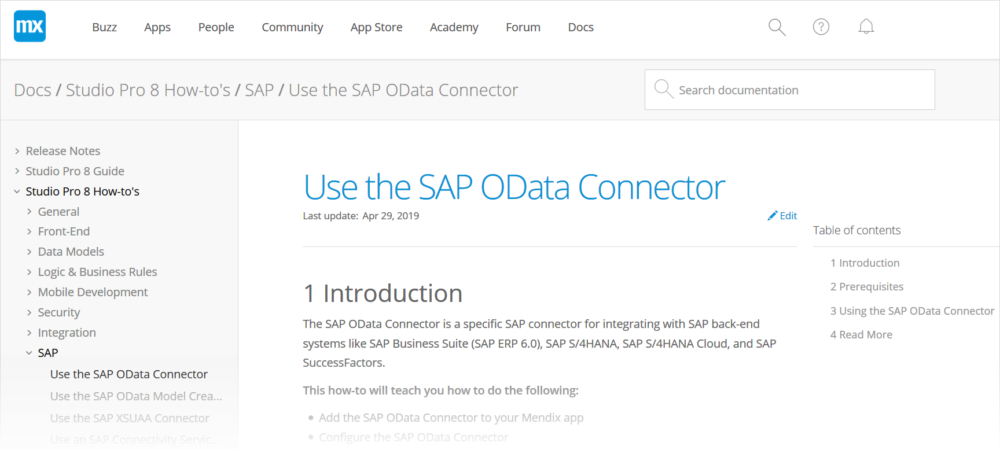

## 1 What Types of Users Can Build Apps with Mendix? {#personas}

Mendix is designed so that anyone with an idea can build an app. Whether you are a marketer, business analyst, or seasoned professional developer, Mendix provides a wealth of resources for you to get started on the platform and leverage your experience in the most effective way possible.

Mendix users have different characteristics and backgrounds. Although these are simplified views, analyzing our users have helped us create certain "personas" that we use to best improve our product features, training courses, and documentation.

These are the most common Mendix user personas we encounter:

* **Curious Cate** – Cate is an application consumer sitting in line-of-business departments like Finance, Marketing, HR, or Operations. She has experience using tools like Excel, Access, Salesforce, and Workday, but uses them in a manual way that impacts her productivity. Cate will use the Mendix Web Modeler to build productivity applications to streamline her work and the work of her team.

* **Solution Sam** – Often called a "business developer" by Forrester, Sam is the go-to technologist and problem-solver on the team. While Sam does not have a technical degree (CS or programming), he is data literate and knows how to create sophisticated Excel models; use SQL to query databases and systems like Salesforce, Hyperion, and SAP; and bring together disparate data to create dashboards using popular business intelligence tools like Tableau, PowerBI, and Qlik. Sam’s combination of business knowledge and tech savviness enables him to play a critical bridge-role in organizations. He understands the business needs (the *why* and *what*) and has the skill to assemble the relevant parts (the *how*) to solve problems. Sam will begin his Mendix journey with the Web Modeler, and then graduate to the Desktop Modeler as his projects grow more complex.

* **Tech Tom** – Tom is a professional developer who wants his applications to drive business value; therefore, he cares more about the solution making an impact than the code it took to create it. Tom is a productive member of the development team and he takes advantage of opportunities to automate repetitive processes, making his life and the lives of his team members easier. Tom’s background may be in .NET or Java, but he is always on the lookout for the next skill to add to his tool belt. Tom spends the bulk of his time using the Desktop Modeler, and he extends the Mendix Platform by building reusable components with Scala, Java, and JavaScript.

* **Hardcore Harry** – Harry is a craftsman of code who is skeptical about low-code platforms because he believes he can create better code faster than dragging and dropping at higher levels of abstraction. Harry has spent much of his career coding in Java, C#, Ruby, or PHP, and he may have experience with rapid-application-development tools of the past. Mendix gives Harry the opportunity to empower Tom, Sam, and Cate to create apps that connect to core systems through reusable extensions made from custom code. These consistent and governed pieces of logic available through a private repository free Harry up to pursue more complex and strategic initiatives using microservices, component-based architectures, and continuous deployment pipelines.

Mendix provides multiple learning paths to onboard these different type of developers. The section [What Are the Mendix Training Options?](#training-options) below explains how we tailor the Mendix learning experience to the type of user.

And for more information on how Mendix empowers various types of developers, see the section [How Does Mendix Support Different Developer Profiles?](../app-lifecycle/app-development#developer-profiles) in *App Development*.

## 2 What Skills Do I Need to Learn Mendix? {#skills-needed}

You do not need to have any software development skills to build apps with Mendix. The Mendix community consists of a wide variety of users, all with different educational backgrounds, work experience, and skills.

That being said, you can use any available programming skills to extend an app with custom code, UX/UI skills to add custom app styling, and database skills to implement performance optimization.

## 3 How Long Does It Take to Learn Mendix? {#how-long-to-learn}

With Mendix, you can build your first application in 30 minutes. Right after you create your account, you will be guided into the platform to build your first app.

To really ramp up your learning, you can follow the [Become a Rapid Developer learning path](https://gettingstarted.mendixcloud.com/link/path/31) online at your own pace, free of charge. There are 11 modules in this learning path, which take about an hour each to complete. So, you could complete all the modules in 2–3 days, and then start building applications straightaway.

There is no time limit to complete a Mendix learning path, which allows you to work through everything in your own time. The modules have individual learning units, each of which take a few minutes to complete. In addition, each module has a knowledge check to verify your understanding and highlight any areas you might need to review again.

After a few months of experience with Mendix app projects, you will be able to get to the [Advanced Developer Certification](https://gettingstarted.mendixcloud.com/link/certification/advanced) level. Users with software experience get here faster than those without any experience in building apps.

The option to register for a three-day [classroom course](https://gettingstarted.mendixcloud.com/link/classroom) is also always available. These are taught by Mendix Academy experts.

Based on a survey conducted amongst developers about learning low-code, we got these answers:

{}

{}

Because the Mendix Platform provides extensive capabilities and does [monthly releases](https://www.mendix.com/releases/) with new features, Mendix users never actually stop learning!

## 4 What Are the Mendix Training Options? {#training-options}

To learn Mendix, you can use the free online courses provided by Mendix Academy, attend a regular classroom course, and participate in live webinars. The [Mendix Academy](https://gettingstarted.mendixcloud.com/) is fully integrated in the platform with an in-product [guided introduction tour](#git), and provides multiple learning paths to onboard all Mendix Platform users.

The online Mendix learning paths have a modular setup, so you can start at any point, go through the content at your own pace, and follow or skip modules based on your needs. The [Academy learning paths](#lp-m) can be filtered according to **Your Role**, **Your Level**, and keyword **Tags** that reflect your interests and goals. This online  content is available for free, and you do not even need to have a Mendix account to use it.

In addition, Mendix offers regular [classroom courses](#classroom) that align with the online learning paths.

### 4.1 Guided Introduction Tour {#git}

Mendix provides a guided product introduction tour of the platform starting in the Web Modeler IDE. When you are creating a new app from the Mendix Developer Portal and you select **Start Your First App** in the **Introduction Tour** tab, the guided tour will open right in the Web Modeler. This tour will show you around the product while also helping you to build an actual app. You can choose to perform the steps yourself or ask the guidance to do them for you.

<video controls  src="attachments/guidance_do.mp4">VIDEO</video>

### 4.2 Academy

You can learn how to use the Mendix Platform without ever having to leave it. To follow a structured path to learn Mendix, navigate directly to the [Mendix Academy](https://gettingstarted.mendixcloud.com/link/home), where you can explore new development territory in your current role or even start a new career.

The Mendix Academy provides the training options described below.

#### 4.2.1 Learning Paths & Modules {#lp-m}

When you want to pioneer a way forward, it's good to start with a path. The Mendix [learning paths](https://gettingstarted.mendixcloud.com/link/path) guide you through various learning modules that build your skills. These paths teach you everything from the fundamentals of how to build a Mendix app to how to improve your UX skills, from how to implement security in your apps to how to handle errors, and from how to configure app model logic to how to track your app's behavior.

The learning paths take you from different starting points, levels, and roles to new stages of Mendix knowledge. Want to get started with the Mendix Platform in less than one hour? The [Start with a Blank App learning path](https://gettingstarted.mendixcloud.com/link/path/14) guides you through the Web Modeler and helps you to build your first app. Want to work on a Mendix development team? The [Become a Rapid Developer learning path](https://gettingstarted.mendixcloud.com/link/path/31) takes you through the key lessons for starting your Mendix development career.

<video controls  src="attachments/learning-path.mp4">VIDEO</video>

The ultimate destination for each learning path is [certification](https://gettingstarted.mendixcloud.com/link/certification). Soon enough, you will be able to follow one of the advanced learning paths to take your career to the next level by specializing in one topic, or you can master them all to get certified as an [Advanced Developer](certification-talent#get-certified).

Each learning path contains various [modules](https://gettingstarted.mendixcloud.com/link/module) that you need to complete. Each module contains theory and assignment units as well as knowledge checks. You can start these whenever you want to learn more about a specific topic.

#### 4.2.2 Classroom Courses {#classroom}

Mendix offers regular [classroom courses](https://gettingstarted.mendixcloud.com/link/classroom) that align with the online learning paths, giving you a hands-on training experience. To start with the fundamentals, sign up for the [Rapid Developer Classroom Course](https://gettingstarted.mendixcloud.com/link/classroom/rapid). Then, to take your skills to the next level and drive digital innovation, check out the [Advanced Developer Classroom Course](https://gettingstarted.mendixcloud.com/link/classroom/advanced).

There are Mendix offices in Boston, Rotterdam, and London where you can receive hands-on training from an experienced team of Mendix Academy Experts. Depending on the amount of students, Mendix can provide on-site training as well.

#### 4.2.3 Webinars

Mendix provides a free series of live and interactive [webinars](https://gettingstarted.mendixcloud.com/link/webinar) that will help you to understand the inner-workings of the platform. The wide range of webinar topics include UX, Java, REST integration, QA, mobile, and performance. Whether you are just getting started with Mendix or you are a veteran developer, there’s something for everyone.

{}

{}

### 4.3 Documentation

You can browse all the documentation for the Mendix Platform on the [Mendix documentation site](https://docs.mendix.com). Here you can find release notes, how to's, reference guide material, API and SDK documentation, and content on all the other components of the platform.

{}

{}
