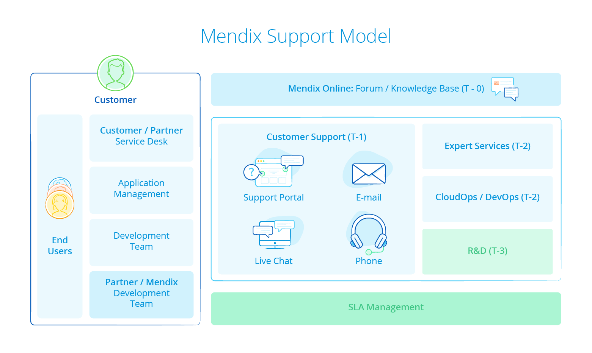
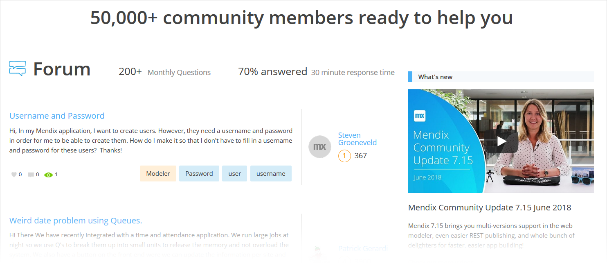
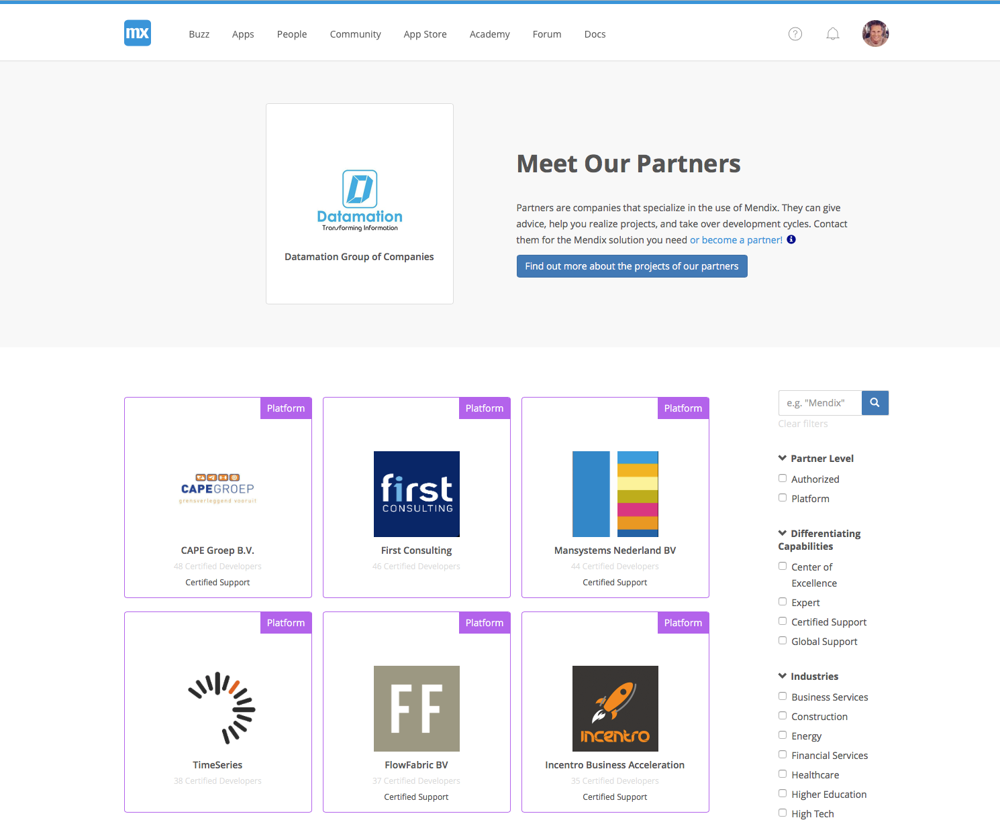

## 1 What Kinds of Additional Support Does Mendix Offer?

If you get stuck on the platform, Mendix provides various support channels, which are described in the sections below. This diagram presents an overview of the various support options:

## 2 Forum and Community Support

The Mendix community is always there to help you, 24-7. [The Mendix Forum](https://forum.mendixcloud.com/link/questions) is where the community comes together to help each other out with questions and answers and to propose ideas for improving the platform. The Forum is closely integrated with the Mendix Profile, so Mendix community members can see all the interesting and useful information about who is participating in the forum.

With the Mendix Profile and the platform's gamification, community members are incentivized to answer questions. This results in 80% of all forum questions being answered within 30 minutes by a Mendix community member.

{}

{}

To find out more about the Mendix Profile and the Mendix community, see section [What Can the Mendix Community Do for Me?](community#community-do-for-me) in *Community*.

## 3 Documentation

You can always investigate the extensive platform documentation on the [Mendix documentation site](https://docs.mendix.com). Here you can find how to's, reference guide material, API and SDK documentation, and content on all the other components of the Mendix Platform. The documentation is hosted on GitHub, which means that the whole Mendix community helps to keep it updated.

## 4 In-Product Chat

For direct support in the platform, Mendix provides an in-product chat functionality. Via this channel, you can receive updates about the latest releases, and you can always start a direct conversation with someone from Mendix Support.

## 5 App Store Support

The [Mendix App Store](https://appstore.home.mendix.com/index3.html) is full of content provided by Mendix and the community. Specific support for App Store content is determined by the content support category and service level agreement (SLA) that you possess.

Mendix distinguishes two supported content categories:

* Mendix Platform
* Community

For Mendix Platform content, the same SLA conditions apply as for the platform. Support for Community content is up to the user or organization providing the content.

For more details, see [App Store Content Support](https://docs.mendix.com/developerportal/app-store/app-store-content-support) in the *Mendix Developer Portal Guide*.

## 6 Mendix Support

Contact with the [Mendix Support Team](http://support.mendix.com) is available for all users of the Mendix Platform. For licensed Mendix customers, Mendix Support is bound to SLAs.

For more details, see [Mendix Support](https://docs.mendix.com/developerportal/support/).

## 7 Application Development Support

### 7.1 Mendix Partners

Customers may wish to outsource the development and management of their applications to a partner. All Mendix development partners have to go through a training and verification process before they can qualify themselves as a Mendix partner. This helps us ensure that our partners deliver a level of service that meets our expectations.

{}

{}

Partners are ranked using the [Mendix Partner Profiles](https://developer.mendixcloud.com/link/partneroverview). Customers can see how many trained and certified engineers each partner has, their [projects](https://developer.mendixcloud.com/link/customers) they have completed, and their references. The partners can be filtered by experience, industry, and area.

The Mendix development partners can give advice, help you realize projects, and take over complete development cycles.

### 7.2 Mendix Expert Services

Mendix Expert Services is here to support our partners and customers in implementing projects. The Expert Services Team is closely involved in all the new product development from Mendix R&D and always up to date about the latest features and developments. This group of highly-trained Mendix developers is often used by our partners and customers as an expert team ready to solve specific issues in the implementation of Mendix apps

### 7.3 Digital Transformation Practice

The digital transformation practice is a framework for the programmatic adoption of low-code at enterprise scale. For more information, see [A Proven Appraoch to Acelerate Digital Transformation](https://www.mendix.com/digital-transformation/)
