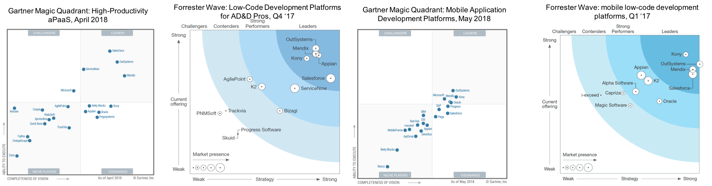

## 1 What Do Gartner and Forrester Say About Mendix?

{}[**update the image of magic quadrants**]{}

Mendix is a leader in four analyst reports at the same time. This section will give an overview of these reports and links to where you can download the report.

### 1.1 Gartner 2018 Magic Quadrant for High Productivity Application Platform as a Service
Mendix was recognized as a leader in hpaPaaS, placed furthest for completeness of vision for 2 years running.

“High-productivity aPaaS supports a no-code or low-code graphical, model-driven development Methodology that enables professional and nonprofessional developers to collaborate and rapidly build and deploy, cloud-native applications. According to Gartner, by 2020, at least 50 percent of all new business applications will be created with high-productivity toolsets.” * *Gartner, Inc., “Market Guide for Application Platforms,” November 23, 2016, Anne Thomas and Aashish Gupta*

Download your complimentary *Gartner 2018 Magic Quadrant for High Productivity aPaaS* analyst report [here](https://www.mendix.com/resources/gartner-high-productivity-apaas-report/?utm_source=google&utm_medium=cpc&utm_term=%2Bmendix&utm_campaign=NL%20-%20Branded&gclid=CjwKCAjw4uXaBRAcEiwAuAUz8O91V7HHyGAr5y7PrGldJyokTLHnGhxO6ojRSQLByLpscXrcAyTeeRoCk3QQAvD_BwE)

### 1.2 The Forrester Wave: Low-Code Development Platforms For AD&D Pros, Q4 2017

A Forrester survey of IT leaders reveals that low-code development platforms speed up application delivery, dramatically improving IT’s ability to respond to business demands.

According to the report, “A well-known low-code platform for AD&D pros, Mendix continues to innovate in new use cases and deepen its features across the board. Its decision to base its low-code environment on Cloud Foundry also paid big dividends, as SAP—a Cloud Foundry distributor—adopted the vendor's platform as its worldwide low-code solution.”

Download your complimentary report *The Forrester Wave™: Low-Code Development Platforms For AD&D Pros, Q4 2017* [here](https://www.mendix.com/resources/forrester-low-code-platform-wave/)

### 1.3 Gartner 2018 Magic Quadrant for Mobile Application Development Platforms

According to Gartner, by 2022, citizen developers will be building more than one-third of web and mobile employee-facing apps delivered in organizations with mature citizen development initiatives. * *Gartner Inc., “Market Guide for Rapid Mobile App Development Tools,” November 30, 2017, Jason Wong*

Download your complimentary *Gartner 2018 Magic Quadrant for Mobile App Development Platforms* analyst report [here](https://www.mendix.com/resources/gartner-magic-quadrant-for-mobile-app-development-platforms/)

### 1.4 Forrester: Mobile Low-Code Development Platforms, Q1 2017

Based on the assessment of the current offering, strategy, and market presence of 11 vendors, Mendix was named a leader in The Forrester Wave™: Mobile Low-Code Development Platforms, Q1 2017.

Download your free *The Forrester Wave™: Mobile Low-Code Development Platforms, Q1 2017* analyst report [here](https://www.mendix.com/resources/forrester-mobile-low-code-wave/)
