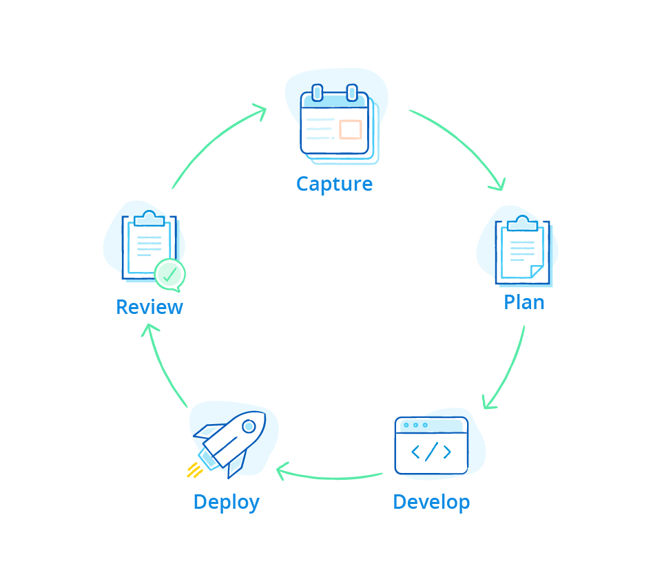

## 1 How Is Mendix Different?

Mendix is the fastest and easiest platform for building and continuously improving mobile and web apps that enable innovation at web scale. It is the only low-code rapid application platform for development and delivery that provides a comprehensive, integrated set of tools for the entire app lifecycle – from ideation and development through deployment and operation.

Mendix is unique in offering both no-code (visual-modeling) and low-code (highly extensible, integrated tooling to support cross-functional teams working collaboratively) tooling in one single platform.

The Mendix development process is architected for the demands of enterprise-ready applications. These apps are maintainable, highly performant, and scalable, and they can cope with the complex nature of enterprise systems and integration.

Through the platform's collaboration and visual development capabilities, Mendix enables a whole range of people with different backgrounds to be successful in building apps that deliver business value in a sustainable way.

This section zooms in on the main aspects of why Mendix is different compared to others in the low-code market.

## 2 What Is Mendix's History of Delivering Innovation?

Innovation happens when people with ideas and technology come together. The culture of innovation has lived within Mendix from the day the company was started, resulting in a long list of industry-first innovations. Here is just a glimpse of the innovations our customers have been able to leverage:

* The first low-code platform to support AI-assisted development (2018)
* Low-code and no-code collaboration via the Web Modeler (2017)
* Model API & SDK (2015)
* Model sharing (2015)
* Cloud Foundry support (2014)
* One-click cloud deployment (2013)
* Full application lifecycle management support (2012)
* Integrated app store (2010)
* Web-based applications, AJAX (2005)

We are committed to keeping the Mendix Platform up to date with the latest technologies so our customers can deliver differentiated applications in record time.

## 3 How Does Mendix Focus on Adding Business Value?

Delivering applications quickly is a key reason for adopting a low-code platform. However, to achieve true agility and scale with application development, Mendix marries speed with collaboration and control. It does this by bringing business and IT together and providing a common language between both worlds.

Mendix involves business users across the application lifecycle, from [requirments management](app-lifecycle/requirements-overview) during the ideation and continuous feedback process, to direct participation in the [development](app-lifecycle/developing-in-mendix) with visual models. The Mendix Platform enables development teams to embrace the [DevOps](app-lifecycle/devops-overview) way of working, with a high focus on involving business users. The next section zooms in on how business users—without any coding experience—can build apps with Mendix.

## 4 How Does Mendix Provide Both Low Code & No Code in a Single Platform?

Both no-code and low-code tools use visual and model-driven development concepts to speed up and transform application development. In a way, the "low-code" and "no-code" labels can be misleading. At Mendix, we think the main distinction is found in the types of people using these tools.

* **No-code tools** (as the name suggests) enable users to build apps without writing any code. The target audience for this capability consists of business analysts, business developers, and citizen developers – users with no or very little experience in software development.
* **Low-code tools** enable a wide range of developers with any level of software development experience.

Organizations that want to harness the power of both groups should look for a rapid application development platform that appeals to both business developers and professional developers. Every user should feel comfortable and empowered to build apps themselves. But the real value is contained in enabling teams of developers from both business and IT with mixed experience levels to collaborate on a single platform and be focused on achieving the same goal – building apps that solve real business problems with unprecedented speed and out-of-the box control.

The Mendix Platform provides the Web Modeler and Desktop Modeler visual modeling environments that combine to deliver an integrated and model-driven app development experience across the full continuum of users. What is more, these modeling environments are integrated with the Mendix Development Portal as the backbone for collaborative modeling.

<video controls src="attachments/Bring-Business-Knowledge-Into-the-App-Development-Process.mp4">VIDEO</video>

## 5 How Does Mendix Support Full Application Lifecycle Management?

The Mendix Platform supports the rapid delivery of applications through an integrated set of tools designed to cover the full application lifecycle. Starting with business requirements management, teams can create a backlog of user stories, Sprints, and release plans. Developers can then use the Web and Desktop Modelers to rapidly build these user stories, continuously merge models, ship revisions for automated testing, refactor feedback from the built-in feedback mechanism and collaboration features of the platform, and deploy using the Mendix Cloud Portal. The Mendix Application Test Suite (ATS) can be used for automated testing. Finally, end-users can use the app's built-in feedback mechanism.

{}

{}

## 6  What Does the Mendix Cloud-Native Architecture Look Like?

The Mendix Cloud-native architecture enables you to scale your applications and nodes while supporting the speed and flexibility required to deliver new functionality. Built-in Agile and DevOps features combine with our Cloud-Foundry (platform-as-a-service [PaaS]) support to allow small cross-functional teams to deploy highly-portable microservices-based apps in containers.

The [Mendix Runtime](enterprise-capabilities/runtime-architecture) executes your applications within the context of a cloud-native architecture by using the [Twelve-Factor Principles](enterprise-capabilities/twelve-factor-architecture). The Mendix Cloud is a PaaS-based [cloud architecture](app-capabilities/mendix-cloud-overview#2-what-does-the-mendix-cloud-architecture-look-like) using Cloud Foundry running on top of AWS.

## 7 What Strategic Partnerships Has Mendix Developed?

Mendix strives to become the standard in low-code development, and therefore actively pursues and integrates the platform with strategic partners. SAP and IBM are the first two [strategic partners](strategic-partners) to adopt Mendix.

[SAP](strategic-partners/sap) has adopted the Mendix Platform as their own rapid application development platform for extending their solutions. The SAP Solution Extension partnership means that you can not only purchase Mendix from SAP directly, but you can quickly and easily integrate Mendix with SAP in a variety of ways while taking advantage of a single point of contact for support and building Mendix apps on top of SAP.

Mendix is also the standard low-code development platform to be used on top of [IBM Cloud](strategic-partners/ibm). This means you can utilize IBM as a single contact for using Mendix on IBM Cloud.

Because of this cloud-native architecture, Mendix apps are portable over different clouds.
