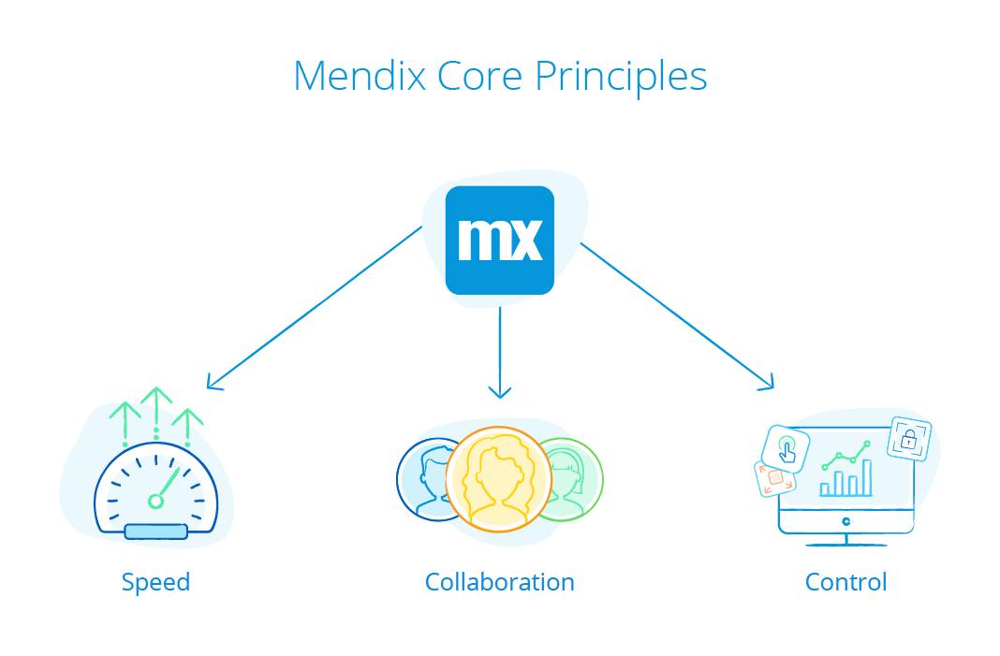

## 1 What Is the Mendix Vision?

Our fundamental belief is that software should not be something just for IT. Every company needs to become a software company to survive in a software-driven world. The whole organization needs to be collaborating on the lifeblood of the business, which is technology. The future of each company depends on it. The key to survival is experimentation and innovation by people that know the business domain.

The Mendix vision is to enable a whole range of people with different backgrounds to be successful in creating software that delivers actual business value in a sustainable way. So, Mendix enables the following roles:

 * **Business domain experts** can develop software in an intuitive and visual way.
 * **Professional developers** can utilize low-level control as well as extensibility to use other programming languages, integration capabilities, debugging capabilities, a completely open meta-model, and APIs to interact with any part of the Mendix Platform, including the models.
 * **IT departments** can manage their application landscapes and provide guardrails for business domain experts to build apps.

## 2 What Are the Mendix Core Principles?

The Mendix Platform is based on three principles that make this vision a reality. You can find these core principles underlying every single platform feature:

* **Speed** – In a world that is changing ever faster, IT backlogs are overflowing. To change that, software needs to be created much faster. App development must take place at the speed of the business.
* **Collaboration** – The talent gap for software development is only widening. Teaching more people to program will not solve this, as the gap is exponentially growing. So, we need to involve a much broader audience in software development. The key to faster and better software delivery is collaboration. The Mendix Platform brings the people with ideas together with the people with the technical aptitude to execute those ideas.
* **Control** – The Mendix Platform is focused on delivering enterprise software. Speed and collaboration are easy for simple applications, but for enterprise-grade software that needs to operate in a complex environment, it is more difficult. With Mendix, security, performance, scalability, and governance are built in. This means that the business can be enabled while IT stays in control.
