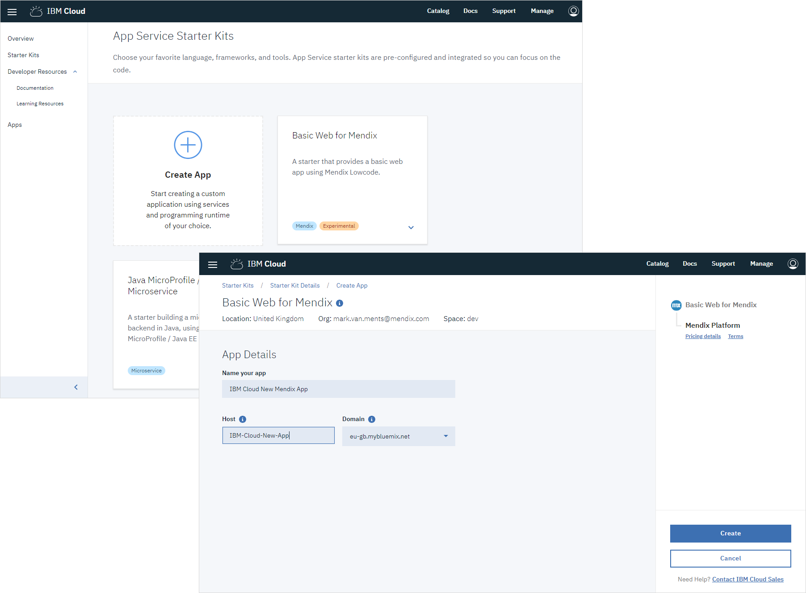
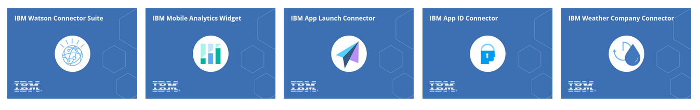

## 1 How Can I Start Using Mendix on IBM Cloud? {#start-ibm}

Mendix can be found in IBM Cloud as starter kits within the standard development experience. There are Watson, web, and mobile options that show you how to start building an application integrating the specific services.

{}

{}

### 1.1 How Can I Run & Deploy My Application on IBM Cloud?

IBM has integrated the provisioning and deployment of Mendix applications directly into the IBM Cloud. This is done using the IBM Toolchain and CI/CD pipeline integration.

For more details, see the section [How Can I Run Mendix on IBM Cloud?](../app-capabilities/strategic-partner-cloud#ibm-cloud) in *Strategic Partner Clouds*.

## 2 Which IBM Services Can I Use Within Mendix? {#ibm-services}

In principle, there are no limitations on consuming any service from IBM Cloud. However, together with IBM, Mendix has created some out-of-the box connectors that accelerate development on top of the services even more.

These are the services available as connectors:

 * [IBM Watson Connector Suite](https://appstore.home.mendix.com/link/app/2860/) (a collection of connectors for IBM Watson cognitive services)
 * [IBM Mobile Analytics Widget](https://appstore.home.mendix.com/link/app/106305/)
 * [IBM App Launch Connector](https://appstore.home.mendix.com/link/app/106382/)
 * [IBM App ID Connector](https://appstore.home.mendix.com/link/app/106198/)
 * [IBM Weather Company Connector](https://appstore.home.mendix.com/link/app/106297/)

