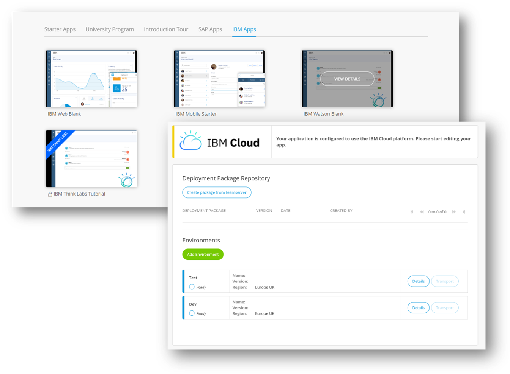

## 1 How Can I Start Using Mendix on IBM Cloud? {#start-ibm}

IBM Cloud can be found wthin the cloud Selection within your application setting as a integrated cloud target. Also when selecting an IBM Starter app within the Mendix application creation journey, for Watson, web, and mobile the IBM Cloud will be the default deployment target, so application data as service data will be within the same cloud. 

{}

## 2 Which IBM Services Can I Use Within Mendix? {#ibm-services}

In principle, there are no limitations on consuming any service from IBM Cloud. However, together with IBM, Mendix has created some out-of-the box connectors that accelerate development on top of the services even more.

These are the services available as connectors:

 * [IBM Watson Connector Suite](https://appstore.home.mendix.com/link/app/2860/) (a collection of connectors for IBM Watson cognitive services)
 * [IBM Mobile Analytics Widget](https://appstore.home.mendix.com/link/app/106305/)
 * [IBM App Launch Connector](https://appstore.home.mendix.com/link/app/106382/)
 * [IBM App ID Connector](https://appstore.home.mendix.com/link/app/106198/)
 * [IBM Weather Company Connector](https://appstore.home.mendix.com/link/app/106297/)

