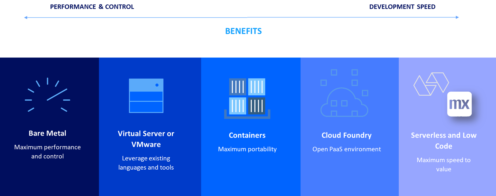
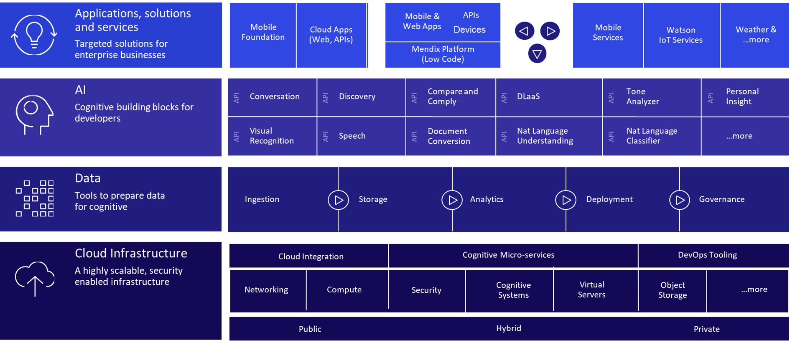

## 1 What Type of Partnership Does Mendix Have with IBM? {#ibm-partnership-type}

IBM has selected Mendix as the standard low-code development platform to be used on top of IBM Cloud. Based on the shared vision of Mendix and IBM and cloud technologies like Cloud Foundry and Kubernetes, the Mendix Platform is a natural fit on top of IBM Cloud.

Because of this strategic reseller partnership, it is possible to purchase Mendix directly from IBM combined with your IBM contract. This will provide you a single contact for your full offering.

The IBM Cloud has the portfolio to deliver a full-stack solution that will drive your business from performance and control to high development speed and innovation. Such a solution will lift and shift your existing workload and create new opportunities to differentiate yourself in the market with smart applications.

To accelerate development, IBM Cloud delivers a broad range of services (which are also called PaaS services). These are directly accessible from the [IBM Cloud Catalog](https://console.bluemix.net/catalog/). Typical services that IBM offers include Watson cognitive services, data management, mobile, services, CI/CD, toolchain services, and starter apps. Mendix has been added as the low-code development tooling on top of this offering in order to bring these services to an even broader group of users.

## 2  What Does the Mendix–IBM Partnership Offer? {#ibm-partnership-offer}

{}[**Note from Adam: Erno, this question was specified by Roald, and it will be linked to from the landing page. Please consult with Roald for what content should go here. Content can probably be moved from other sections of this doc.**]{}
