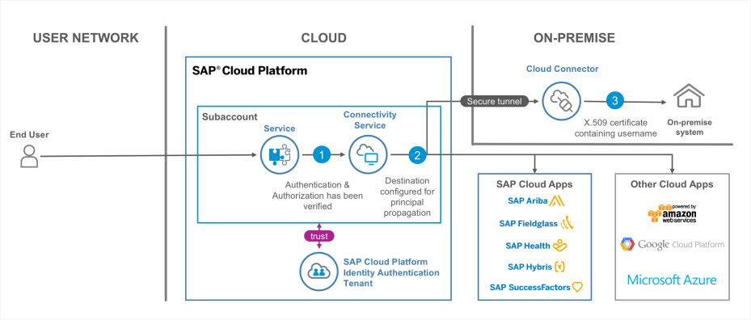
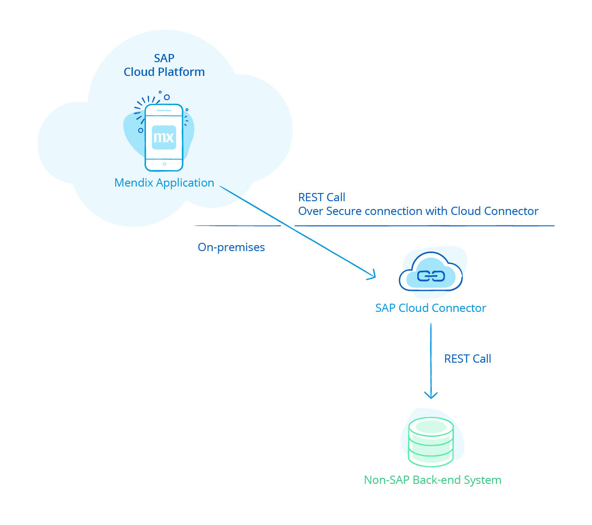
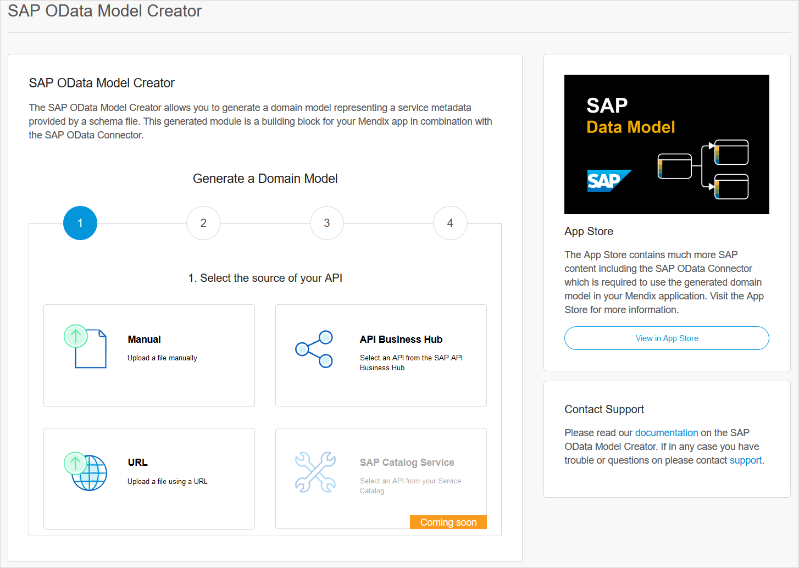
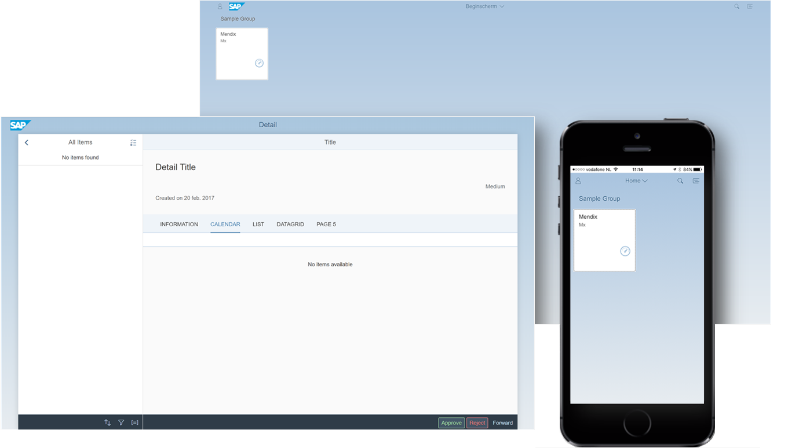

## 1 How Can I Deliver a Single Sign-On Experience in My Mendix App Extending SAP?

SAP Cloud Platform comes with a standard identity provider (IDP) integration, also known as a trust configuration within the SAP Cloud Platform. This is a standard SAML2-based trust between your IDP and the SAP Cloud Platform.

After configuring this trust, a Mendix application automatically integrates with the IDP. By mapping the Mendix application roles with the self-defined SAP Cloud Platform roles attached to your IDP, you can log in to the Mendix application with the specific assigned role using your corporate identity.

For more details, see [How to Use the XSUAA Connector for SAP Cloud Platform](https://docs.mendix.com/partners/sap/use-sap-xsuaa-connector) in the *Mendix Strategic Partners Guide*.

## 2 How Does Mendix Support Principal Propagation Between My Mendix App & the SAP Back-End System? {#principal}

In combination with the SAP Cloud Platform, Mendix delivers an integration with SAP back-end systems based on [SAP principal propagation](https://cloudplatform.sap.com/scenarios/usecases/principal-propagation.html) both on premises and for the cloud. By connecting your IDP to the SAP Cloud Platform, it becomes possible to log in to all of your Mendix applications running on the SAP Cloud Platform via a specific role using your own IDP with an SSO experience. The end-user (called "the principal") then gains access to your SAP back-end system based on a trust configuration using the Cloud Connector (as the principal user).

For on-premises systems, this is realized by setting up a trust between the [SAP Cloud Connector](https://docs.mendix.com/partners/sap/sap-cloud-connector), SAP Cloud Platform, and SAP Cloud Connector with your SAP back-end system. For SAP Cloud Platform solutions, this is done using an SAML2-to-oAuth assertion using a destination service, as presented in this diagram:

{}

{}

## 3 How Can I Use the SAP Cloud Connector to Integrate Mendix with Non-SAP Apps? {#integrate}

The SAP Cloud Connector allows you to set up connections to any end-point within your premises. Because the SAP Cloud Connector acts as a secure reverse proxy, the Mendix native REST and web services integrations have been extended with the support to configure the use of the SAP Cloud Connector. This makes it possible to integrate with any REST-based or web services (SOAP)-based solution within your premises when running your Mendix application within the SAP Cloud Platform.

{}

{}

## 4 How Does Mendix Support Extending Cloud Services like SAP SuccessFactors & SAP Hybris?

Cloud solutions like SAP SuccessFactors, SAP Hybris, SAP Concur, and SAP Ariba are all enabled with OData support. Using the Mendix [OData Connector for SAP solutions](https://appstore.home.mendix.com/link/app/74525/), Mendix apps can integrate with these SAP Cloud Platform solutions. This integration also includes support for principal propagation.

## 5 How Can I Use SAP Data Within My Mendix App?

Together with SAP, Mendix has created an API discovery solution based on OData metadata files and SAP API Business Hub integration. This allows you to generate a Mendix domain model within your application from any SAP service in order to represent the data set of your service.

Along with the OData Connector for SAP solutions, this allows you to consume any service provided by SAP within a few clicks.

{}

{}

## 6 How Can I Integrate Mendix with SAP Fiori? {#integrate-with-sap-fiori}

The Mendix SAP integration comes with a standard application template for SAP Fiori-styled applications. This template includes the primary SAP Fiori page layout and theming, so your application can be used within the SAP Fiori launchpad next to your existing SAP Fiori applications.

Mendix applications can even be used within the SAP Fiori mobile launchpad, with the support of native mobile integrations.

{}

{}

## 7 Why Should I Use OData Instead of BAPI?

The standard integration protocol that SAP uses for extending SAP products is the Open Data Protocol (OData). OData is an ISO/IEC-approved OASIS standard that defines a set of best practices for building and consuming RESTful APIs. As OData is based on REST, it is fully optimized for both cloud and on-premises integrations. This is why SAP positions the use of OData above traditional BAPI integrations with your SAP products.

Another reason to use OData is that in addition to SAP Business Suite and SAP S/4HANA being OData-enabled, cloud products like SAP SuccessFactors, SAP Ariba, SAP Concur, and SAP Hybris are also OData-enabled. That gives you a single integration experience between all the SAP products available.

For SAP Business Suite, SAP Gateway (also known as SAP NetWeaver) is used to publish services in OData. This is supported for both standard and custom (Z-) services in your SAP Business Suite stack.

Based on this strategy, the jointly-owned integration between Mendix and SAP is based on OData. This does not  exclude the ability to also use BAPI, but it is not recommended by either SAP or Mendix.

## 8 How Can I Run & Deploy My Mendix Application on the SAP Cloud Platform?

For details on deploying on the SAP Cloud Platform, see the section [How Does Mendix Run on the SAP Cloud Platform?](../app-capabilities/strategic-partner-cloud#running-sap-cloud) in *Strategic Partner Clouds*.
