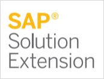
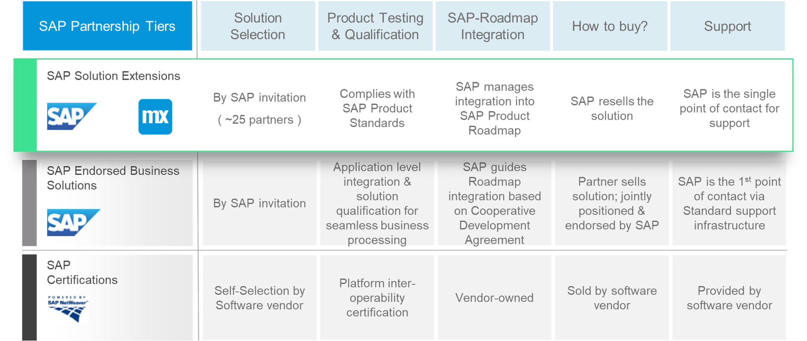
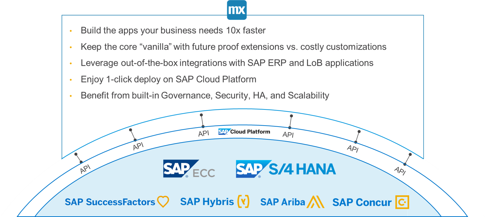

## 1 What Type of Partnership Does Mendix Have with SAP? {#sap-partnership-type}

Mendix has a partnership with SAP of the **Solution Extension** type. With this partnership, SAP has fully adopted the Mendix Platform as their own rapid application development platform to extend SAP solutions like SAP Business Suite, SAP S/4HANA, SAP SuccessFactors, and more. Customers of SAP will be able to benefit from their existing or new investments using the best-in-class system of record of SAP while being flexible enough to make required business changes in order to stay competitive and differentiating in the market.

The Solution Extension partnership is on invitation only by SAP, and it is the closest form of partnership with SAP possible. With this partnership, SAP positions the Mendix Platform as their own product. The product name that SAP uses for Mendix is the **SAP Cloud Platform Rapid Application Development by Mendix**. The SAP Cloud Platform Rapid Application Development by Mendix provides the optimal developer experience to speed up innovation and leverage the value of SAP's standard product offering both on premises and in the cloud.

This chart presents details on the SAP partnership types:

The benefits of the SAP and Mendix partnership are the following:

* The ability to purchase the Mendix Platform directly from SAP
* Mendix Platform complies to SAP product standards
* Single point of contact for support
* SAP manages and guarantees integration into the SAP product roadmap

## 2 What Does the Mendix–SAP Partnership Offer? {#sap-partnership-offer}

SAP together with Mendix offers the ability to extend digital core of SAP with low-code and rapid application development. This partnership brings the best of two worlds together by offering best-in-class products like SAP S/4HANA, SAP SuccessFactors, and SAP Hybris together with the ability to implement customization based on your company's differentiating needs in a controlled, collaborative, and fast way.

Mendix extensions are full stack, so they include data, logic and UI. This makes it possible to keep the data layer of your system of records clean from data that should not belong in there. This also makes it possible to keep your systems of record "vanilla," with the added benefit of being able to update your SAP system more easily and keep maintenance costs low for your SAP system. This way, extensions are named  as side-by-side extensions by SAP.

## 3 How Can I See the Road Map of SAP Cloud Platform Rapid Application Development by Mendix?

As part of its Solution Extension partnership, Mendix has a shared road map with SAP. This road map is published online and is publicly available as long as you have an SAP ID.

The road map contains a two-quarter forecast and a production vision that provides insight into the production direction of Mendix with SAP.

For details, see the public [SAP Cloud Platform Rapid Application Development by Mendix Road Map](https://www.sap.com/products/roadmaps.html?sort=title_asc&search=mendix#pdf-asset=a07b68ed-fc7c-0010-87a3-c30de2ffd8ff&page=11).

## 4 How Can I Kick-Start My SAP Development Project?

The Mendix Platform provides several SAP starter apps as part of the onboarding process for creating new applications.

Starter apps are complete app frameworks that can be used as a starting point when building a new app on the Mendix Platform. They provide the scaffolding required to massively accelerate app development, as they include basic design patterns such as branding, design assets, page templates, navigation, and security models.

<video controls src="attachments/CreateSAPAppSmaller.mp4">VIDEO</video>
