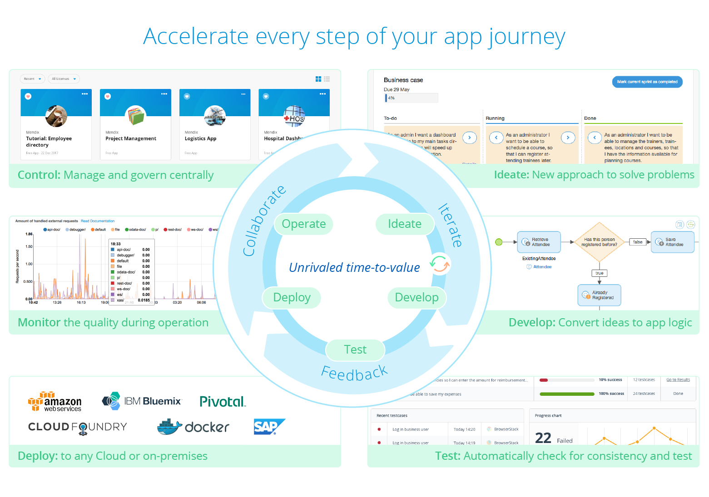

## 1 What Is Mendix?

Mendix is a high productivity app platform that enables you to build and continuously improve mobile and web applications at scale. The Mendix Platform is designed to accelerate enterprise app delivery across your entire application development lifecycle, from ideation to deployment and operations.

Mendix enables you to implement both Agile and DevOps best practices. It even goes beyond that by involving business stakeholders in the actual development of the applications.

Mendix offers both no-code and low-code tooling in one single fully integrated platform:

* **No code** – Mendix provides a web-based visual modeler that is tailored toward business domain experts
* **Low code** – an extensive and powerful desktop-based visual modeler is also provided, which is tailored towards professional developers and can be integrated with coding IDEs to extend capabilities

The result of this no-code and low-code combination is that business domain experts (like analysts and citizen developers) can work alongside expert developers to achieve much greater levels of alignment and accelerated delivery. Moreover, the Mendix Platform’s cloud-native architecture and automation tools support the deployment, management, and monitoring of highly available enterprise-grade applications.

<video controls src="attachments/Bring-Business-Knowledge-Into-the-App-Development-Process.mp4">VIDEO</video>

Based on our three core principles of **speed**, **collaboration**, and **control**, Mendix offers a complete platform for your enterprise application delivery needs.

## 2 How Does Mendix Support Each App Lifecycle Step?

This section explains all the components of the Mendix Platform that enable you to accelerate every step of your app life cycle, from ideation to development, deployment, testing, and the ongoing management of your application portfolio in the cloud or on premises.

### 2.1 Ideation & Requirements Management

The first step of the application lifecycle management process is ideation. The Mendix Developer Portal enables a new approach to solving problems and facilitates the [requirements management](app-lifecycle/requirements-management) of your app development project. The Developer Portal provides capabilities such as Sprint and user story management as well as integrated feedback management via embedded widgets that empower end-users to provide feedback directly within an application. This closed feedback loop enables the development team to quickly resolve queries from the business, facilitating rapid iteration.

The value of collaboration is strengthened through the Mendix Platform’s support for Agile requirements management. Learn about the Agile tools built into Mendix that will help you manage your projects and teams effectively from day one in the video below.

<video controls src="attachments/Ideation-Requirements-Management.mp4">VIDEO</video>

### 2.2 Development & Testing

The next step is to develop your application and convert ideas into apps. Mendix uses visual modeling languages for all the aspects of an application, and the platform is designed for a variety of users, even as it provides powerful capabilities to developers for their day-to-day work.

* **Business Analysts & Business Developers** can directly use the Mendix Web Modeler to build, review, and collaborate on an app.
* **Developers** with a technical programming background can use the Mendix Desktop Modeler along with Java and JavaScript to build and extend an app.
* **Product Owners & Scrum Masters** can use the Mendix Developer Portal to govern user requirements, end-user feedback, and Sprint backlogs.
* **End-users** involved in running acceptance tests can use the app in combination with the Mendix Feedback Widget. This feedback is directly connected to the Mendix Developer Portal, so the Product Owner can review and validate the user feedback.

With Mendix, development is visual from start till finish, which ensures that the customer is engaged and requirements are aligned throughout the development cycle.

To make sure developers do not get stuck, Mendix makes sure that any model is extensible. In this way, highly specific application features and low-level optimizations can be built without sacrificing the benefits of model-driven development.

The Mendix Platform provides development teams with an extensive toolset to set up effective quality assurance with efficient test automation, such as an integrated automated quality governance tool called Application Quality Monitor (AQM). AQM monitors app quality during operation, offers a dashboard that provides instant insight into the quality of the app models you are building, and provides insight on the right granularity of apps and microservices.

To discover more about all these capabilities, see [Developing in Mendix](app-lifecycle/developing-in-mendix).

### 2.3 Deployment & Operations

Mendix provides all the cloud deployment options you need and is fully optimized for compatibility with the latest cloud platforms and technologies. Running and deploying your Mendix app in the Mendix Cloud is easy, fast, and flexible. The Mendix Cloud is a PaaS-based cloud offering based on Cloud Foundry technology. A Mendix app runs in a container provided by Cloud Foundry and has standard support for horizontal and vertical scaling (without any downtime) as well as auto-healing.

The ability to deploy with one click to any cloud environment or on premises directly from Mendix's modeling environment enables developers with any background to bring applications to their users. In short, the Mendix Platform enables development teams to embrace the DevOps way of working, which means that a single team can develop, maintain, and support apps in production while adhering to enterprise requirements.

<video controls src="attachments/Deployment-Operations.mp4">VIDEO</video>

Read more in the [DevOps Overview](app-lifecycle/devops-overview) about why cloud technology is at the core of the Mendix Platform.
