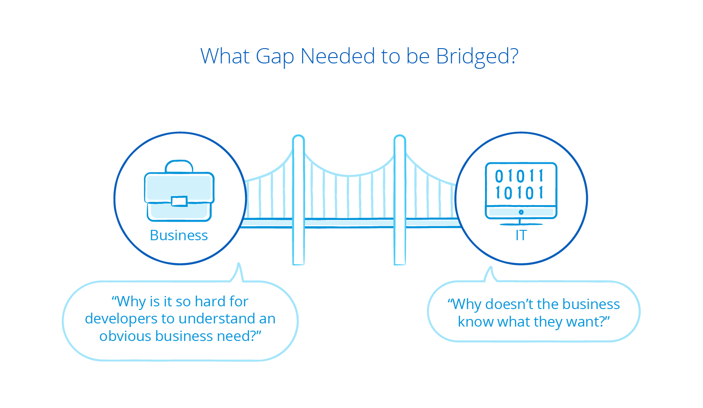
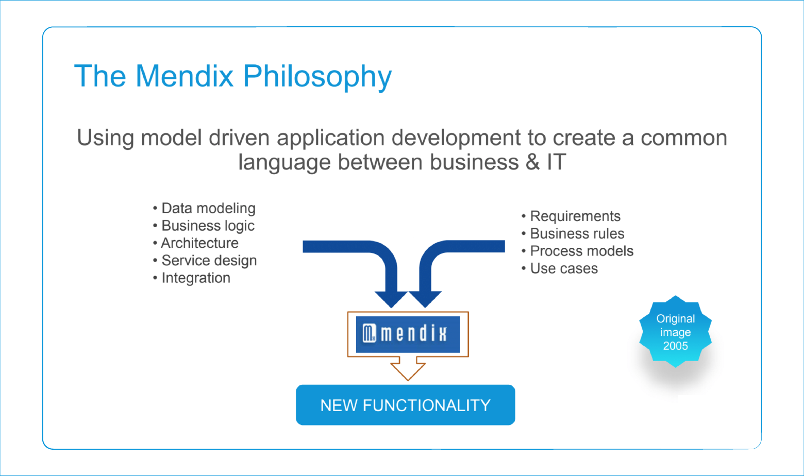

## 1 Why Was Mendix Founded? {#founded}

The founders of Mendix learned it the hard way – delivering software that fulfills business needs is extremely hard and fails more often than it succeeds. Mendix was founded on the belief that software development could only be significantly improved if there was a paradigm shift. And that’s exactly what Mendix introduced.

## 2 How Did It All Start?

Rewind the clock to the early 2000s. One of the founders of Mendix (Roald Kruit) is developing software as a freelance developer. Time and time again, he find that—despite long hours of work and all the best intentions—the customer (which often means the business) is not happy with the result. Even creating long functional requirement documents up front does not help solve the problems. The result is a frustrated customer, along with a frustrated and increasingly demotivated developer.

Why does this keep happening? It does not take long for Roald to realize that apparently he does not understand the business, no matter how many lengthy documents are generated and long requirements meetings are held. Many implicit assumptions exist on both the business and the IT side about how the software should work and the way it should look. And even when there is perceived alignment, the next day, the customer's requirements change, either consciously or unconsciously, which brings the whole process back to square one. Why can't the business simply make up their minds about what they want? Determined to get to the root of this problem, Roald gets an MBA. It is during his studies that he gets a full view on how large and how fundamental the gap actually is.

In any organization, people on the business side and people on the IT side think and act inherently differently. Unless that gap is bridged, there is very little chance that any software project will be remotely successful.

## 3 What Was The Philosophy That Led To Found Mendix?

As a next step, Roald starts using visual tools—such as flow charts, user interface mockups, and process mappings—in the requirements discovery and software design phase. This allows the business to validate his interpretation of their requirements before any coding happens and solves the problem of a developer having to reverse-engineer the requirements further down the line. Although this is a very valuable step forward, it leaves Roald with three additional problems:

* Once validated, the actual coding becomes far less interesting, since the majority of thought process has happened during the requirements and design phase.
* Programming often involves many repetitive tasks, which in the end do not make any developer happy.
* It is becoming harder to keep up to date with the rapidly evolving number of programming tools and languages across the spectrum. It is virtually impossible for a single developer to be proficient in back-end tooling, front-end tooling, database tooling, and the different operating systems at the same time. This makes developers highly dependent on other people with specific skills, which adds significant lead time to the software development project.

Meanwhile, the two other founders of Mendix (Derek Roos and Derckjan Kruit) are experiencing the business-IT gap from the opposite side – the business. They are asking the following questions:

* Why is it so hard for developers to understand an obvious business need?
* Why do so many IT projects fail, resulting in wasted time and money, not to mention pointless blame-shifting games that nobody ever wins?

At this point in the story, it is 2005, and Mendix is founded to bridge the business-IT gap and provide organizations and people a whole new way of delivering and differentiating with innovative apps.

This is a new way, both in the technology used as well as in the process that is applied.

## 4 How Is Mendix Different Than 4GL?

Avoiding the pitfalls of 4GL tooling (which basically create tomorrow's legacy), the Mendix founders set out to make visual model-driven development (MDD) a reality. The two core principles of this approach are abstraction and automation:

 * **Abstraction** – a software application model is defined on a higher abstraction level than in traditional coding
 * **Automation** – the model is then converted into a working application using automated transformations or interpretations

The right MDD approach leverages model execution at runtime rather than generating code. The model is transformed automatically into a working software application by interpreting and executing it. This removes the need to generate code at all.

With Mendix, MDD  is visual from start till finish. This helps to make sure the customer is engaged and the requirements are always aligned, right from the get-go and throughout the development cycle. So that developers do not get stuck, Mendix makes sure that any model is extensible. In this way, highly specific application features and low-level optimizations can be built without sacrificing the benefits of MDD.

## 5 What Development Process Bridges the Gap Between Business and IT?

Mendix has always realized that you need more than technology to bridge the gap between business and IT. An iterative and Agile process is required that allows key users and stakeholders to be involved at every step, allowing for fast experimentation and on-the-spot feedback.

While this process can be applied to any software development project, the unique combination of fast and visual MDD with an iterative Agile process speeds up the development hugely. At the same time, it ensures the customer will be happy with the result, removing a lot of frustration and setting the customer up for success.

And thus Mendix came into creation.

## 6 Why the Name "Mendix"?

The name Mendix is derived from the verb *to mend*, which means to repair anything that is broken, torn, defaced, or the like. Mendix is here to mend the app delivery process.

Mendix is full of people committed to helping companies win in a software-driven world by successfully bridging this fundamental gap between business and IT.
